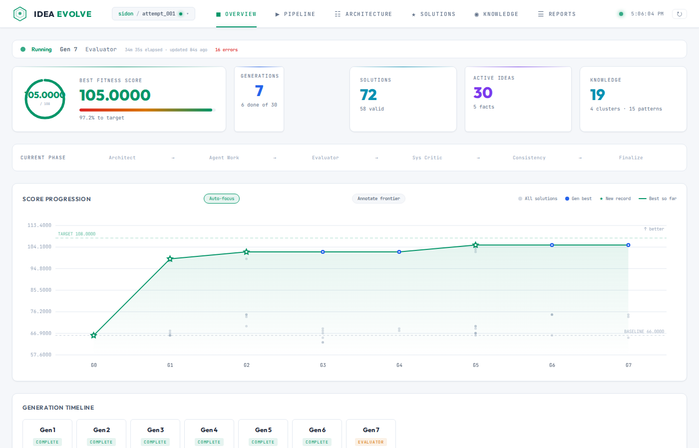
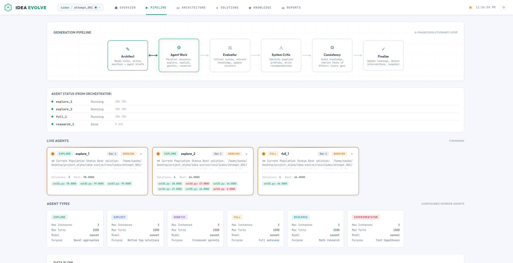
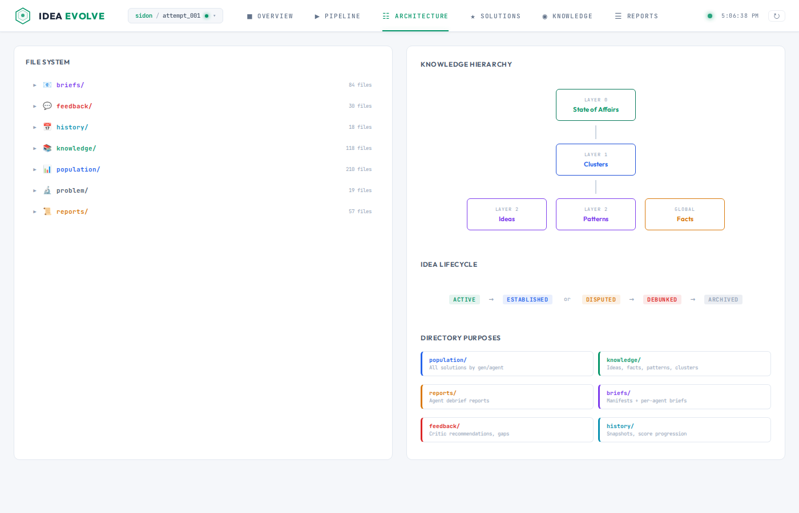
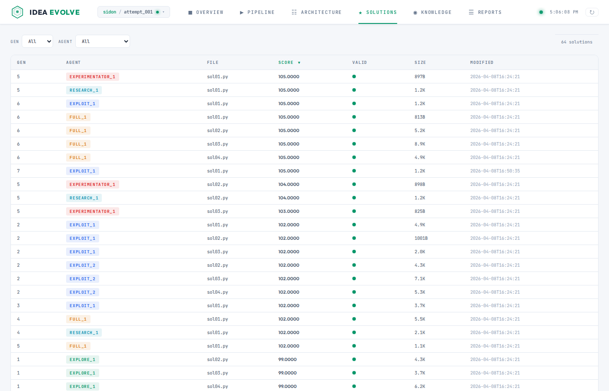
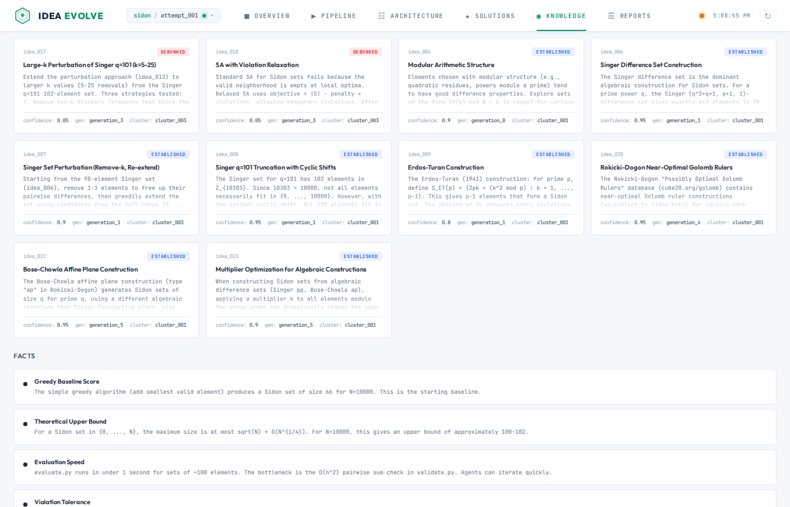
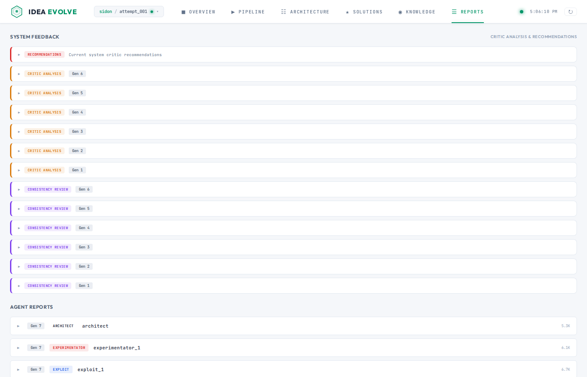

# Idea Evolve

Evolutionary code optimization through collaborative AI agent work sessions. Multiple specialized Claude agents — architects, explorers, exploiters, researchers — work in parallel to evolve increasingly better solutions to hard optimization problems.



## How It Works

A stateless orchestrator runs generations of AI agents. Each generation, an Architect agent plans the strategy, then 3-8 specialized agents work in parallel — writing solutions, evaluating them, and iterating. An Evaluator extracts knowledge (ideas, patterns, facts) from all results. Over many generations, the system builds a shared knowledge base that guides future exploration.

```
Architect  →  Agent Work  →  Evaluator  →  System Critic  →  Consistency  →  Finalize
 (plan)      (parallel AI     (score +       (diagnose         (audit           (rank +
              agents write     extract        pipeline          knowledge        update
              solutions)       knowledge)     issues)           base)            scores)
```

All state lives in files. If the orchestrator crashes, it resumes from exactly where it left off.

## Prerequisites

| Requirement | Install | Purpose |
|------------|---------|---------|
| **Python 3.12+** | `sudo apt install python3 python3-venv` | Orchestrator, dashboard, evaluation |
| **Node.js 22+** | [NodeSource](https://github.com/nodesource/distributions#installation-instructions) | Claude Code CLI runtime (`npx`) |
| **Claude Code** | `npm install -g @anthropic-ai/claude-code` | AI agent sessions |
| **Anthropic API key** | [console.anthropic.com](https://console.anthropic.com) | Set `ANTHROPIC_API_KEY` env var |

Some problems may have additional dependencies (e.g., `g++` for GEMM compilation). Check `problems/{id}/description.md` for problem-specific requirements.

## Setup

```bash
git clone <repo-url> && cd idea-evolve

# Install Node.js 22+ (required for Claude Code CLI)
curl -fsSL https://deb.nodesource.com/setup_22.x | sudo -E bash -
sudo apt-get install -y nodejs

# Install Claude Code CLI
npm install -g @anthropic-ai/claude-code

# Python environment
python3 -m venv venv
source venv/bin/activate
pip install -r requirements.txt

# API key
export ANTHROPIC_API_KEY="sk-ant-..."  # add to ~/.bashrc for persistence
```

## Running the Orchestrator

**Always `cd idea-evolve` first.** The orchestrator takes `.` as the project root.

```bash
source venv/bin/activate
cd idea-evolve

# Start a new attempt on a problem
python3 orchestrator.py . --problem sidon --new-attempt --single

# Continue the latest attempt (1 generation)
python3 orchestrator.py . --problem sidon --single

# Full run (all generations)
python3 orchestrator.py . --problem sidon

# Resume from a specific generation
python3 orchestrator.py . --problem sidon --start-gen 5

# Use a specific attempt
python3 orchestrator.py . --problem sidon --attempt attempt_002

# Preview without launching agents
python3 orchestrator.py . --problem sidon --dry-run

# Background with logging
python3 orchestrator.py . --problem sidon --single >> /tmp/run.log 2>&1 &
tail -f /tmp/run.log
```

Two orchestrators can run simultaneously on different problems — each works in its own isolated run directory with no shared state.

## Defining a Problem

Each problem lives in `problems/{id}/` with:

| File | Purpose |
|------|---------|
| `description.md` | Problem statement and context |
| `constraints.md` | Hard constraints solutions must satisfy |
| `evaluate.py` | Evaluation harness (caches results by content hash) |
| `validate.py` | Correctness check — invalid solutions get sentinel score |
| `metrics.yaml` | Fitness direction (higher/lower is better), target, decimals |
| `helpers/` | Shared utility functions available to all agents |
| `initial_programs/` | Baseline solutions to seed generation 0 |

See existing problems (`gemm`, `permcodes`, `sidon`) for examples.

## Dashboard

```bash
source venv/bin/activate
python dashboard/app.py              # http://localhost:5000
python dashboard/app.py --port 8080  # custom port
python dashboard/app.py --debug      # hot reload
```

The dashboard reads directly from the filesystem — no database. It auto-detects all problems and attempts from `problems/` and `runs/`. Click the breadcrumb in the header to switch between problems and attempts.

### Overview

Score progression chart, generation timeline, and key metrics at a glance. Toggle the "Frontier" button to see annotated callouts on record-breaking solutions. The status beacon shows whether the orchestrator is running (green), idle (gray), stale (amber), or crashed (red).


### Pipeline

Live view of the current generation's agent pipeline. Shows per-agent status (waiting/running/done/failed), agent type stats, recent errors, and data flow between phases. Reads from durable `gen_progress.json` — survives orchestrator crashes.



### Architecture

Visual map of the run directory structure, knowledge hierarchy (State of Affairs → Clusters → Ideas/Patterns/Facts), and idea lifecycle stages.



### Solutions

Sortable, filterable table of every evaluated solution. Sorted best-first (respects fitness direction). Color-coded: green (valid), red (invalid), orange (error). Click any row to see details.



### Knowledge

The three-layer knowledge hierarchy built up across generations:
- **State of Affairs** (L0) — strategic overview, updated periodically
- **Clusters** (L1) — groups of related ideas
- **Ideas, Patterns, Facts** (L2) — individual knowledge items with lifecycle tracking



### Reports

Agent debrief reports and system feedback grouped by generation. Includes critic analyses, consistency reviews, and per-agent reports summarizing what was tried, what worked, and insights for future agents.



## Agent Types

| Agent | Model | Purpose |
|-------|-------|---------|
| `explore` | sonnet | Novel approaches — structurally different from existing solutions |
| `exploit` | sonnet | Refine top solutions with targeted improvements |
| `genetic` | sonnet | Crossover: combine strengths from two parent solutions |
| `full` | sonnet | Full autonomy — read everything, try anything |
| `research` | sonnet | Mathematical research — read papers, derive new approaches |
| `experimentator` | opus | Create shared helper utilities for all agents |

## Project Structure

```
idea-evolve/
├── orchestrator.py          # Stateless main loop
├── agents/                  # Prompt templates (10 agent types)
├── prompts/                 # Shared prompt fragments
├── user/                    # config.yaml, initial_ideas.md, interventions.md
│
├── problems/                # Problem definitions (read-only at runtime)
│   ├── gemm/                #   Binary-ternary GEMM optimization
│   ├── permcodes/           #   Permutation codes M(n,d)
│   └── sidon/               #   Sidon sets (B₂ sequences)
│
└── runs/                    # All evolution data, per problem + attempt
    └── {problem}/
        └── {attempt}/       # Self-contained run
            ├── population/  #   genNNN/{agent}/sol*.py + .score
            ├── knowledge/   #   state_of_affairs.md, ideas/, clusters/
            ├── history/     #   all_scores.json, eval_cache.json
            ├── briefs/      #   genNNN/manifest.yaml + agent briefs
            ├── reports/     #   genNNN/{agent}.md debrief reports
            ├── feedback/    #   system_recommendations.md, analyses
            └── workspace/   #   ephemeral agent workspaces

dashboard/                   # Flask web UI (no database, reads filesystem)
├── data/                    #   Scanning + config
├── routes/                  #   API + page routes
├── templates/               #   Jinja2 templates
└── static/                  #   CSS + vanilla JS
```

## Error Recovery

If the orchestrator crashes, restart with the same command:

```bash
python3 orchestrator.py . --problem sidon --single
```

- Completed agents are skipped (tracked in `gen_progress.json`)
- Orphaned agent processes are killed automatically
- Each phase checks completion before re-running
- No manual cleanup needed

## Documentation

- **[CLAUDE.md](CLAUDE.md)** — Operational reference, all known issues, architectural decisions
- **[IDEA_EVOLVE_COMPLETE_V4.md](IDEA_EVOLVE_COMPLETE_V4.md)** — Full system specification
- **[dashboard/README.md](dashboard/README.md)** — Dashboard architecture and API endpoints
