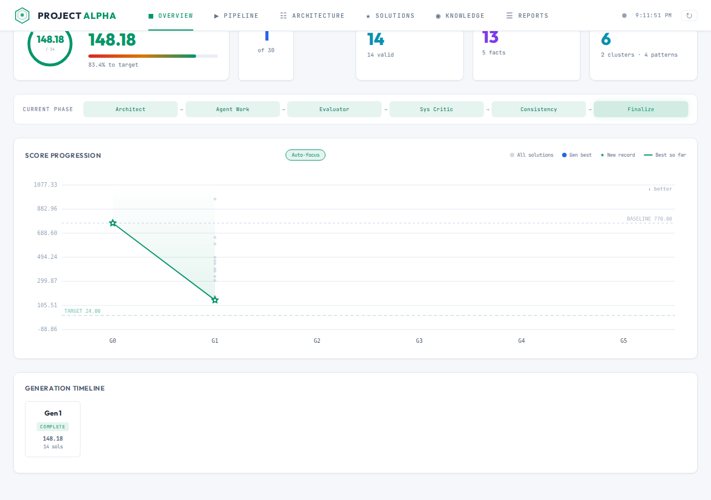
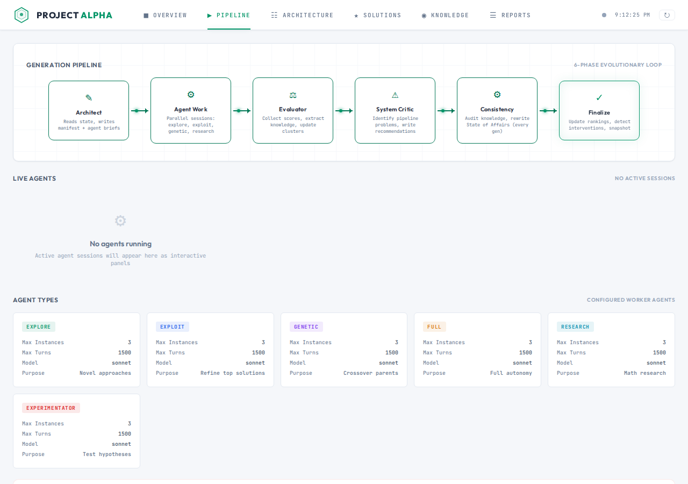
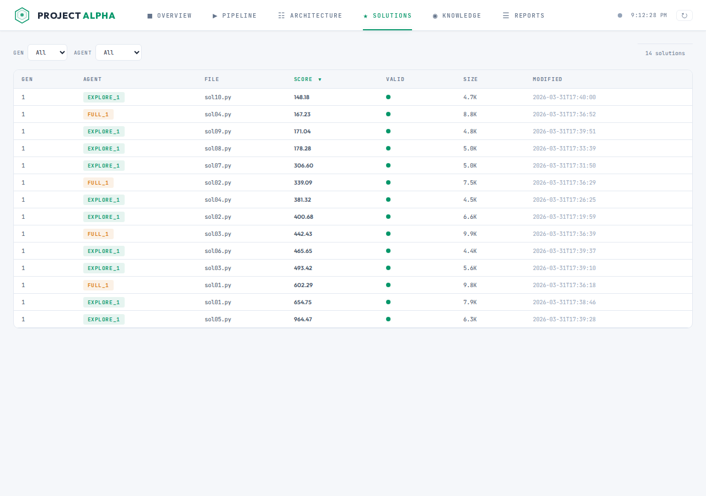

# Alpha Evolve

Evolutionary code optimization through collaborative AI agent work sessions. Multiple specialized Claude agents (architects, explorers, exploiters, researchers) work in parallel to evolve increasingly better solutions to hard optimization problems.

## How It Works

Alpha Evolve runs an evolutionary loop where each **generation** goes through 6 phases:

1. **Architect** -- an AI agent analyzes the current state and plans which agents to launch
2. **Agent Work** -- specialized agents (explore, exploit, genetic, research) run in parallel, each writing and evaluating solutions
3. **Evaluator** -- collects scores, extracts knowledge (ideas, patterns, facts), updates clusters
4. **System Critic** -- reviews agent reports, identifies pipeline problems
5. **Consistency Review** -- periodic audit of the knowledge base
6. **Finalize** -- update rankings, progression tracking, detect interventions

All state lives in files. The orchestrator is stateless -- if it crashes, it resumes from the last completed phase.

## Quick Start

```bash
# 1. Setup
python3 -m venv venv
source venv/bin/activate
pip install -r requirements.txt

# 2. Run (must cd into alpha-evolve first)
cd alpha-evolve
python3 orchestrator.py . --single    # one generation
python3 orchestrator.py .              # full run (30 generations)
python3 orchestrator.py . --dry-run    # preview plan without launching

# 3. Monitor in background
python3 orchestrator.py . --single >> /tmp/run.log 2>&1 &
tail -f /tmp/run.log
```

## Dashboard

A web UI for tracking runs in real time.

```bash
source venv/bin/activate
python dashboard/app.py          # http://localhost:5000
```

### Overview -- score progression and generation timeline



### Pipeline -- generation phases and agent status



### Solutions -- ranked table of all evaluated solutions



## Current Problem

**Binary-Ternary GEMM Optimization** -- optimizing C++ matrix multiplication kernels for Intel Tiger Lake (AVX-512). Solutions are Python files that return C++ source code strings. The evaluator compiles, validates correctness, and benchmarks across 3 matrix sizes.

- Baseline: ~770 us
- Target: 24 us (~32x speedup)
- Best so far: 148.18 us after 1 generation

## Project Structure

```
alpha-evolve/
  orchestrator.py       # Stateless generation loop
  problem/              # Problem definition, evaluator, validators
  agents/               # Prompt templates for each agent type
  knowledge/            # Three-layer hierarchy: state of affairs > clusters > ideas/patterns/facts
  population/           # All solutions, organized by generation and agent
  history/              # Score progression, timing, eval cache
  briefs/               # Per-generation architect plans and agent briefs
  reports/              # Agent debrief reports
dashboard/              # Flask web UI
images/                 # Screenshots and diagrams
```

## Documentation

All detailed documentation, known issues, and operational notes are maintained in [CLAUDE.md](CLAUDE.md). The full system specification (architecture, agent roles, knowledge model, file formats, configuration) is in [ALPHA_EVOLVE_COMPLETE_V4.md](ALPHA_EVOLVE_COMPLETE_V4.md). Changes and updates go into CLAUDE.md only -- this README is a static overview.
